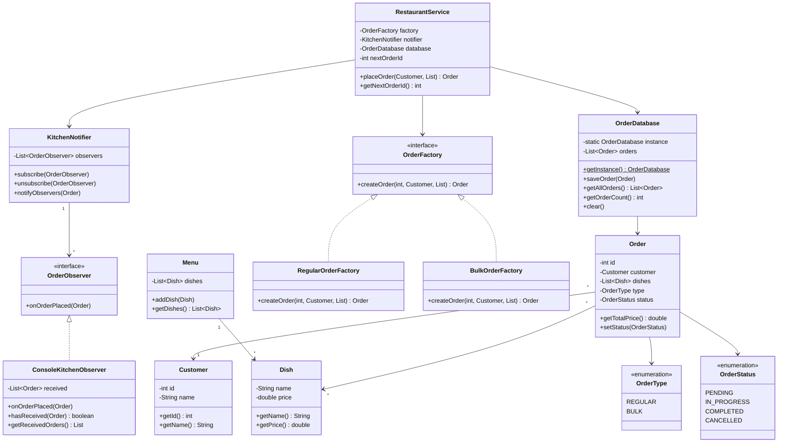

# Restaurant Ordering System


Java-система управління замовленнями ресторану з трьома патернами GoF: **Singleton**, **Factory**, **Observer**.

---

## Part 1 — SOLID

| Принцип | Де застосовано |
|---|---|
| **SRP** | Кожен клас має одну відповідальність: `Order` зберігає дані замовлення, `RestaurantService` — логіку розміщення, `OrderDatabase` — зберігання |
| **OCP** | `OrderFactory` — інтерфейс. Новий тип замовлення = новий клас, без змін у існуючому коді |
| **LSP** | `RegularOrderFactory` і `BulkOrderFactory` взаємозамінні скрізь, де очікується `OrderFactory` |
| **ISP** | `OrderObserver` містить лише один метод `onOrderPlaced(Order)` — нічого зайвого |
| **DIP** | `RestaurantService` залежить від `OrderFactory` (інтерфейс), а не від конкретних фабрик |

---

## Part 2 — TDD

Розробка велась за циклом **Red → Green → Refactor**:

1. Спочатку писали тест, який падав (`RED`)
2. Реалізовували мінімальний код для проходження (`GREEN`)
3. Рефакторили без зміни поведінки (`REFACTOR`)

Приклад: тест `testBulkOrderAppliesDiscount` написано до реалізації знижки в `BulkOrderFactory` — спочатку тест падав, потім в `Order.getTotalPrice()` додано `* 0.9` для `BULK`-типу.

Усі 65 тестів охоплюють:
- модельні класи (`Dish`, `Customer`, `Order`, `Menu`)
- фабрики (`RegularOrderFactory`, `BulkOrderFactory`)
- патерн Observer (`KitchenNotifier`)
- Singleton (`OrderDatabase`)
- сервіс (`RestaurantService`)

---

## Part 3 — Design Patterns

### Singleton — `OrderDatabase`

Єдиний екземпляр бази замовлень у всьому додатку. `getInstance()` із подвійною перевіркою (`synchronized`) гарантує потокобезпечність.

```java
OrderDatabase db1 = OrderDatabase.getInstance();
OrderDatabase db2 = OrderDatabase.getInstance();
System.out.println(db1 == db2); // true
```

### Factory — `OrderFactory`

Інтерфейс `OrderFactory` з двома реалізаціями:
- `RegularOrderFactory` — звичайне замовлення, без знижки
- `BulkOrderFactory` — оптове замовлення, знижка 10%

```java
OrderFactory factory = new BulkOrderFactory();
Order order = factory.createOrder(1, customer, dishes);
// order.getTotalPrice() = сума * 0.9
```

### Observer — `KitchenNotifier`

`RestaurantService` не знає, хто отримає сповіщення. Кухня підписується через `subscribe()`, отримує кожне нове замовлення через `onOrderPlaced()`.

```java
KitchenNotifier notifier = new KitchenNotifier();
notifier.subscribe(new ConsoleKitchenObserver());
// при placeOrder() → кухня автоматично отримує замовлення
```

### Діаграма класів



---

## Тести

### CustomerTest — 5 тестів

| # | Тест |
|---|---|
| 1 | `testCustomerCreation` |
| 2 | `testCustomerGetId` |
| 3 | `testCustomerGetName` |
| 4 | `testCustomerNullNameThrows` |
| 5 | `testCustomerBlankNameThrows` |

### DishTest — 8 тестів

| # | Тест |
|---|---|
| 1 | `testDishCreation` |
| 2 | `testDishGetName` |
| 3 | `testDishGetPrice` |
| 4 | `testDishZeroPriceAllowed` |
| 5 | `testDishNegativePriceThrows` |
| 6 | `testDishNullNameThrows` |
| 7 | `testDishBlankNameThrows` |
| 8 | `testDishToString` |

### MenuTest — 8 тестів

| # | Тест |
|---|---|
| 1 | `testMenuIsEmptyInitially` |
| 2 | `testAddDishToMenu` |
| 3 | `testMenuSizeAfterAdd` |
| 4 | `testMenuNotEmptyAfterAdd` |
| 5 | `testMenuDoesNotContainUnadded` |
| 6 | `testAddNullDishThrows` |
| 7 | `testGetDishesIsUnmodifiable` |
| 8 | `testGetDishesContainsAdded` |

### OrderTest — 10 тестів

| # | Тест |
|---|---|
| 1 | `testOrderCreation` |
| 2 | `testOrderAssociatedWithCustomer` |
| 3 | `testOrderDefaultStatusIsPending` |
| 4 | `testOrderTotalPrice` |
| 5 | `testOrderStatusChange` |
| 6 | `testOrderNullCustomerThrows` |
| 7 | `testOrderEmptyDishesThrows` |
| 8 | `testOrderGetType` |
| 9 | `testOrderGetId` |
| 10 | `testOrderDishesIsUnmodifiable` |

### OrderFactoryTest — 10 тестів

| # | Тест |
|---|---|
| 1 | `testRegularFactoryCreatesOrder` |
| 2 | `testRegularFactoryCreatesRegularType` |
| 3 | `testBulkFactoryCreatesOrder` |
| 4 | `testBulkFactoryCreatesBulkType` |
| 5 | `testFactorySetsCorrectCustomer` |
| 6 | `testFactorySetsCorrectId` |
| 7 | `testFactoryCreatedOrderIsPending` |
| 8 | `testDifferentFactoriesProduceDifferentTypes` |
| 9 | `testBulkOrderAppliesDiscount` |
| 10 | `testRegularOrderHasNoDiscount` |

### KitchenNotifierTest — 9 тестів

| # | Тест |
|---|---|
| 1 | `testSubscribeIncreasesCount` |
| 2 | `testUnsubscribeDecreasesCount` |
| 3 | `testNotifyCallsObserver` |
| 4 | `testNotifyMultipleObservers` |
| 5 | `testNoObserversNoException` |
| 6 | `testSubscribeNullThrows` |
| 7 | `testObserverReceivesCorrectOrder` |
| 8 | `testObserverReceivesMultipleOrders` |
| 9 | `testUnsubscribedObserverNotNotified` |

### OrderDatabaseTest — 8 тестів

| # | Тест |
|---|---|
| 1 | `testSingletonNotNull` |
| 2 | `testSingletonReturnsSameInstance` |
| 3 | `testSaveOrder` |
| 4 | `testGetAllOrdersContainsSaved` |
| 5 | `testOrderCountIncrements` |
| 6 | `testSaveNullOrderThrows` |
| 7 | `testClearRemovesAllOrders` |
| 8 | `testGetAllOrdersIsUnmodifiable` |

### RestaurantServiceTest — 7 тестів

| # | Тест |
|---|---|
| 1 | `testPlaceOrderReturnsOrder` |
| 2 | `testPlaceOrderNotifiesKitchen` |
| 3 | `testPlaceOrderSavedToDatabase` |
| 4 | `testPlaceOrderIncrementsId` |
| 5 | `testPlaceOrderNullCustomerThrows` |
| 6 | `testPlaceOrderEmptyDishesThrows` |
| 7 | `testBulkServiceAppliesDiscount` |

---

## Запуск

```bash
mvn test
```

```
[INFO] Results:
[INFO]
[INFO] Tests run: 65, Failures: 0, Errors: 0, Skipped: 0
[INFO]
[INFO] BUILD SUCCESS
```

---

## Структура проєкту

```
src/
├── main/java/com/restaurant/
│   ├── Main.java
│   ├── model/        — Dish, Menu, Customer, Order, OrderType, OrderStatus
│   ├── factory/      — OrderFactory, RegularOrderFactory, BulkOrderFactory
│   ├── observer/     — OrderObserver, KitchenNotifier, ConsoleKitchenObserver
│   ├── singleton/    — OrderDatabase
│   └── service/      — RestaurantService
└── test/java/com/restaurant/
    ├── CustomerTest.java
    ├── DishTest.java
    ├── MenuTest.java
    ├── OrderTest.java
    ├── OrderFactoryTest.java
    ├── KitchenNotifierTest.java
    ├── OrderDatabaseTest.java
    └── RestaurantServiceTest.java
```
